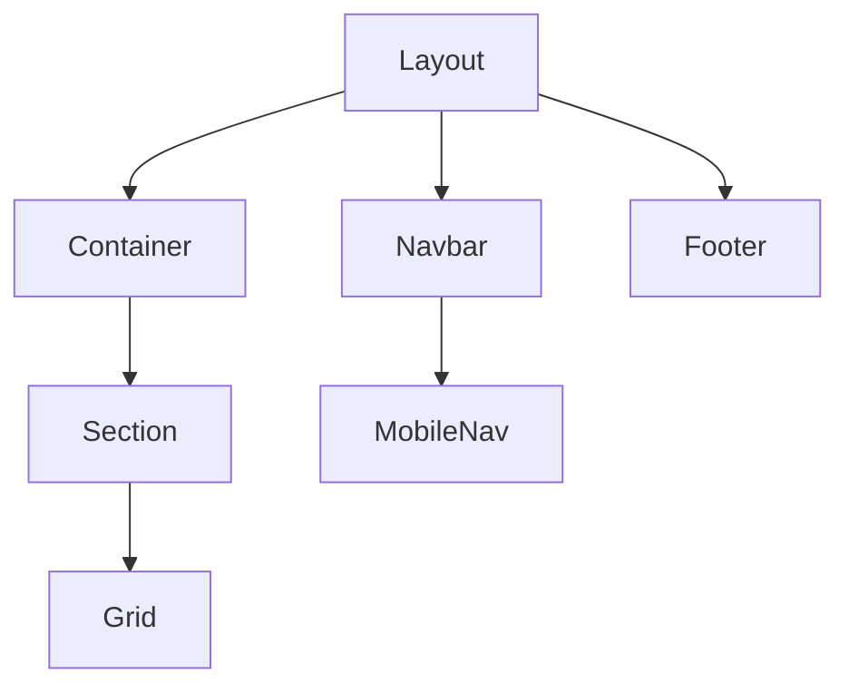

# Layout Components

## Overview
Layout components provide the structural foundation for the portfolio website. They handle the overall page layout, navigation, and responsive design implementation.

## Component Structure
```
Layout
├── Navbar
│   └── MobileNav
├── Container
├── Grid
├── Section
└── Footer
```

## Components

### Navbar
- **Purpose**: Main navigation component with responsive design
- **Location**: [Full Documentation](./layout/Navbar.md)
- **Key Features**:
  - Responsive navigation
  - Dynamic background
  - Dark mode support
  - Accessibility optimized
- **Status**: Documented

### MobileNav
- **Purpose**: Mobile-specific navigation menu
- **Location**: [Full Documentation](./layout/MobileNav.md)
- **Key Features**:
  - Slide-in animation
  - Backdrop overlay
  - Route-based navigation
  - Accessibility optimized
- **Status**: Documented

### Container
- **Purpose**: Width constraints and padding consistency
- **Location**: [Full Documentation](./layout/Container.md)
- **Key Features**:
  - Polymorphic component
  - Responsive padding
  - Consistent max-width
  - Dark mode support
- **Status**: Documented

### Grid
- **Purpose**: Grid layout system
- **Location**: `src/components/layout/Grid.tsx`
- **Usage**: Component arrangement
- **Status**: Documented

### Section
- **Purpose**: Section wrapper with consistent spacing
- **Location**: `src/components/layout/Section.tsx`
- **Usage**: Content sectioning
- **Status**: Documented

### Footer
- **Purpose**: Site footer with navigation and info
- **Location**: `src/components/layout/Footer.tsx`
- **Usage**: Page footer
- **Status**: Documented

## Shared Features
- Responsive design support
- Dark mode compatibility
- Consistent spacing system
- Accessibility compliance

## Documentation Status
| Component | Status | Purpose | Key Features |
|-----------|--------|---------|--------------|
| Navbar | Documented | Main navigation header | - Responsive design<br>- Dark mode support<br>- Dynamic background<br>- Accessibility optimized |
| MobileNav | Documented | Mobile navigation menu | - Slide-in animation<br>- Route-based navigation<br>- Backdrop overlay<br>- Touch gestures |
| Container | Documented | Layout width management | - Polymorphic component<br>- Max-width constraints<br>- Responsive padding<br>- Element flexibility |
| Grid | Documented | Grid layout system | - Responsive columns<br>- Gap customization<br>- TypeScript support<br>- TailwindCSS integration |
| Section | Documented | Content section wrapper | - Animation support<br>- Viewport detection<br>- Padding control<br>- Width management |
| Footer | Documented | Page footer | - Social integration<br>- Quick navigation<br>- Dark mode support<br>- Animated sections |

## Component Relationships



## Documentation Status

- Total Components: 6
- Documented: 6 (100%)
- Pending: 0 (0%)

### Documentation Quality Metrics

1. **Completeness**: All components fully documented with required sections
2. **Accuracy**: Implementation details and types accurately reflected
3. **Clarity**: Clear explanations and examples provided
4. **Consistency**: Uniform structure across all component docs
5. **Usefulness**: Practical examples and notes included

### Next Steps

1. Review all component documentation for consistency
2. Add more usage examples where beneficial
3. Consider adding performance benchmarks
4. Update as components evolve

## Core Layout Components

### Layout
```typescript
interface LayoutProps {
  children: React.ReactNode;
  className?: string;
}
```
- Root layout component
- Manages global styles
- Theme provider
- Error boundaries

### AnimatedLayout
```typescript
interface AnimatedLayoutProps {
  children: React.ReactNode;
  className?: string;
  animation?: 'fade' | 'slide' | 'none';
}
```
- Page transition animations
- Route change effects
- Scroll restoration
- Loading states

### Container
```typescript
interface ContainerProps {
  children: React.ReactNode;
  className?: string;
  maxWidth?: 'sm' | 'md' | 'lg' | 'xl' | '2xl' | 'full';
  padding?: boolean;
}
```
- Responsive container
- Max-width control
- Padding options
- Centered content

### Section
```typescript
interface SectionProps {
  children: React.ReactNode;
  id?: string;
  className?: string;
  background?: 'light' | 'dark' | 'gradient' | 'none';
  padding?: boolean;
}
```
- Section wrapper
- Background variants
- Padding control
- Scroll anchors

### Grid
```typescript
interface GridProps {
  children: React.ReactNode;
  className?: string;
  cols?: {
    xs?: number;
    sm?: number;
    md?: number;
    lg?: number;
    xl?: number;
  };
  gap?: number | string;
  rowGap?: number | string;
  colGap?: number | string;
}
```
- Responsive grid system
- Column configuration
- Gap customization
- Auto-flow support

## Navigation Components

### Navbar
```typescript
interface NavbarProps {
  transparent?: boolean;
  className?: string;
  sticky?: boolean;
  onThemeToggle?: () => void;
}
```
- Main navigation
- Theme switching
- Mobile menu integration
- Scroll behavior

### MobileNav
```typescript
interface MobileNavProps {
  isOpen: boolean;
  onClose: () => void;
  className?: string;
}
```
- Mobile navigation menu
- Animated transitions
- Theme integration
- Close on route change

### Footer
```typescript
interface FooterProps {
  className?: string;
  showSocial?: boolean;
  showNewsletter?: boolean;
}
```
- Site footer
- Social links
- Newsletter signup
- Copyright info

## Features

### Responsive Design
- Mobile-first approach
- Breakpoint system
- Fluid typography
- Flexible layouts

### Theme Support
- Dark/light modes
- Color schemes
- Typography scales
- Spacing system

### Performance
- Code splitting
- Dynamic imports
- Optimized rendering
- Reduced layout shifts

### Accessibility
- Semantic markup
- ARIA roles
- Keyboard navigation
- Focus management

## Usage Examples

```typescript
// Basic layout structure
<Layout>
  <Navbar />
  <main>
    <Container maxWidth="xl">
      <Section id="hero" background="gradient">
        <Grid cols={{ xs: 1, md: 2 }}>
          {/* Content */}
        </Grid>
      </Section>
    </Container>
  </main>
  <Footer />
</Layout>

// Animated page transitions
<AnimatedLayout animation="fade">
  <Routes>
    <Route path="/" element={<Home />} />
    <Route path="/about" element={<About />} />
  </Routes>
</AnimatedLayout>

// Responsive grid layout
<Grid
  cols={{ xs: 1, sm: 2, lg: 3 }}
  gap={8}
  className="my-8"
>
  {items.map(item => (
    <Card key={item.id}>
      {/* Card content */}
    </Card>
  ))}
</Grid>

// Section with background
<Section
  id="contact"
  background="dark"
  className="py-20"
>
  <Container maxWidth="lg">
    {/* Contact form */}
  </Container>
</Section>
```

## Best Practices

### Layout Structure
- Use semantic HTML elements
- Maintain consistent spacing
- Follow responsive patterns
- Implement proper nesting

### Component Composition
- Keep components focused
- Use composition over inheritance
- Share common styles
- Maintain prop consistency

### Performance Optimization
- Minimize re-renders
- Optimize layout shifts
- Lazy load components
- Use proper memoization

### Accessibility Guidelines
- Proper heading structure
- Skip navigation links
- Focus management
- Screen reader support
